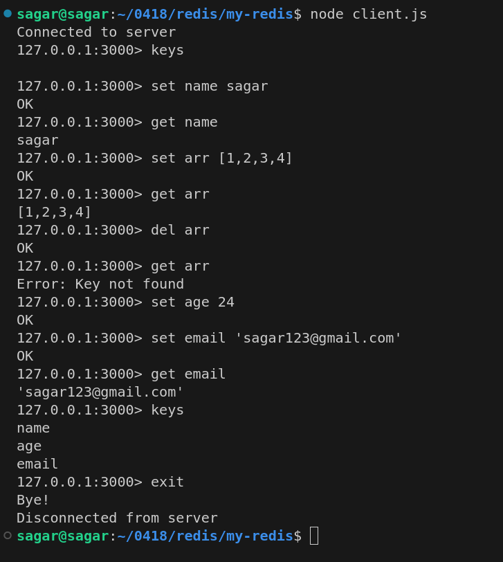

# Simple Redis-like Key-Value Store

This project implements a basic Redis-like key-value store server and client application using Node.js. The server supports fundamental Redis commands such as `SET`, `GET`, `DEL`, `KEYS`, and `EXIT` for interacting with an in-memory storage.

## Features

### Server
- **In-Memory Storage**: Simulates Redis functionality by storing key-value pairs in memory.
- **Supported Commands**:
  - `SET <key> <value>`: Stores the given key-value pair.
  - `GET <key>`: Retrieves the value for a given key.
  - `DEL <key>`: Deletes a key-value pair.
  - `KEYS`: Lists all stored keys.
  - `EXIT`: Closes the connection.
- **Error Handling**: Provides descriptive error messages for invalid commands or missing arguments.

### Client
- **Command Execution**: Allows users to interact with the server using Redis-like commands.
- **Interactive Prompt**: Displays responses from the server and maintains a clean input-output flow.
- **Graceful Exit**: Handles server disconnection and connection errors seamlessly.

## How It Works
1. The **server** listens on `127.0.0.1:3000` for incoming client connections.
2. Clients connect to the server and interact through a terminal-based interface.
3. Commands are sent from the client to the server, processed, and results are sent back to the client.
